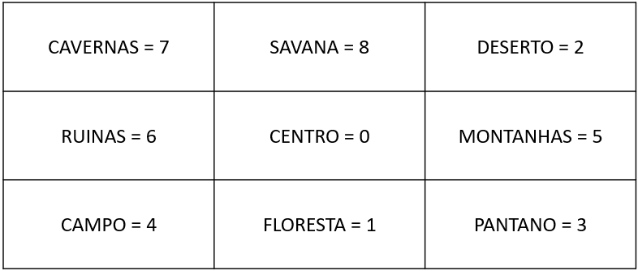

# Grupo 9

**Integrantes:**
- **Arthur Buzelin**
- **Cecília Junqueira**
- **Felipe Gomide**
- **Lucas Junqueira**

# SIMULADOR DE JOGOS VORAZES
- O projeto foi inspirado na saga "Jogo Vorazes". O jogador será capaz de tomar decisões se ele deseja batalhar, mover para outra região, recolher armas, remédios, comida e/ou armas, tendo como principal objetivo sobreviver até o fim, tornando-se, então, o campeão.

## Pré-requisitos
- Para executar o programa corretamente, é necessário ter instalado o compilador C++ (g++ preferencialmente).

## Como executar:
1. Para acessar o repositório do projeto, digite no terminal "cd 20231-team-9"
2. Digite `make` para **compilar o projeto**
3. Digite `make tests` para **executar os testes**
4. Digite `make clean` para deletar os arquivos binários localizados no diretório "build"
5. **Execução**: `./bin/main`

## INFORMAÇÕES IMPORTANTES SOBRE O JOGO
- O programa é composto por participantes do tipo `Jogador`, cujas decisões sobre o que será feito no jogo são tomadas pelo usuário e inseridas no terminal, e do tipo `Bot`, que tem tais decisões automatizadas e aleatórias.
- Todos os participantes iniciam o jogo na Região Centro.
- Todo participante tem os seguintes atributos, que assumem o valor igual a 100 no início do jogo: HIDRATAÇÃO e ENERGIA

- Os participantes podem acumular ao longo do jogo *água*, *comida*, *remédio* e *arma*. Inicialmente, os participantes (jogadores + bots) estão com os atributos referentes às quantidades de 'água', 'comida' e 'remédio' iguais a zero e estão, também, desarmados.

- Ao longo do jogo, cada participante pode acumular quantas águas, comidas e remédios que ele quiser na funcionalidade "Buscar na região" (que será explicada mais à frente) e ele apenas mudará de arma se ele achar uma mais poderosa do que a que ele tem no momento.

- O que acontece se consumir cada um dos utensílios:
    - Água: campo `hidratação` vai para 100 e `energia` permanece inalterado.

    - Comida: campo `energia` vai para 100 e `hidratação` permanece inalterado.
    - Remédio: tanto `hidratação`, quanto `energia` vão para 100.

-  Possíveis armas e seus respectivos poderes:
    - Desarmado: poder = 1;
    - Faca: poder = 2;
    - Arco: poder = 3;
    - Espada: poder = 4;
    - Machado: poder = 5;

## REGIÕES QUE COMPÕE O JOGO
- O jogo é composto por 9 regiões:
    - Centro
    - Floresta
    - Pantano
    - Montanhas
    - Deserto
    - Ruinas
    - Campo
    - Cavernas
    - Savana
- Um participante só pode mover para as regiões adjacentes à que ele está no momento

# COMO JOGAR
1. Ao executar o programa, será pedido ao usuário que ele insira no terminal um número inteiro de 1 a 5, que determinará quantos objetos da classe `Jogador` serão criados.
    - Após isso, ele deverá inserir os nomes de cada um dos jogadores
    - No que tange aos `Bots`, ele poderá escolher se quer nomear cada Bot, ou se prefere que isso seja feito pelo programa.

2. Após concluir tal etapa, todos os jogadores, que estão armazenados em um container, serão embaralhados em cada rodada, a fim de definir a ordem de jogada. Dessa forma, cada `Jogador` pode escolher **UMA** entre as **QUATRO** possíveis ações estabelecidas no jogo:
    - ***MOVER PARA OUTRA REGIÃO***: a partir da Região que o participante está, ele só pode mover para as **regiões adjacentes à corrente**. Caso ele insira uma que não seja adjacente, tal erro será tratado pelo programa, sendo solicitado outra entrada do nome de uma região, até que seja inserida o nome correspondente a uma região que atenda à condição.
    
        - Sempre que o participante se locomove, seu campo *"hidratação"* é reduzido em 20 unidades.

    > m *nome_da_região*

    - ***BUSCAR UTENSÍLIOS***: cada região possui uma probabilidade fixa de possuir cada um dos utensílios. Ao escolher essa ação, é executada um código que sorteia uma porcentagem e, se o número obtido for menor ou igual à probabilidade referente a cada utensílio e arma, o jogador adiciona à sua coleção o que foi obtido naquela rodada.

        - Sempre que o participante se locomove, os campos *"hidratação"* *"energia"* são reduzidos em 15 unidades.
    > b

    - ***UTILIZAR UTENSÍLIO***: ao selecionar tal ação, o personagem deve indicar qual utensílio (água, comida ou remédio) ele quer consumir e, com isso, será descontado 1 unidade da coleção referente ao utensílio ingerido. Caso seja selecionado um utensílio que o jogador não possui, será solicitado que ele insira outro utensílio. Além disso, se ele não possuir nenhum dos três utensílios, ele é forçado a *buscar na região* (isso é automatizado), para não desperdiçar sua jogada.

        - Ao consumir *alimento*, o campo "comida" é mudado para 100. Ao consumir *água*, o campo hidratação é mudado para 100 e, ao consumir *remédio*, ambos os campos vão para 100.
    > u *nome_do_utensílio*

    - ***BATALHAR***: ao selecionar tal ação, o participante tem acesso a todos os outros jogadores que estão na mesma região que ele. Deve ser inserido no terminal o nome de um participante e, caso o nome não exista ou o participante não esteja na região daquele que tomou a decisão, é solicitado que o usuário permaneça inserindo nomes, até inserir o nome de alguém que esteja na sua região. Porém, se o participante estiver sozinho, ele é forçado a buscar utensílios na região.
        - O vencedor da batalha é aquele que possui a arma de maior poder. O perdedor é morto e excluído do jogo e o vencedor tem o seu campo "energia" subtraído por 10 vezes o poder na arma do adversário.
        - Caso ambos tenham armas com o mesmo poder, ninguém morre, mas os dois têm suas energia diminuída em 10 vezes o poder da arma do adversário.

    > a *nome_do_adversário*

### Como um jogador por morrer:
- Sendo morto em uma batalha por outro participante com uma arma mais poderosa.
- À medida que batalha, move de região e busca utensílios, a energia e a hidratação caem e, caso esses campos cheguem a 0 (mesmo que alcance tais níveis após vencer uma batalha), o participante também morre.

## FIM DO JOGO
- O jogo terminará quando apenas um participante sobreviver, independente do nível de energia ou hidratação que ele tiver.

# User Stories
- Como Participante da Edição do Jogo, quero ser capaz de me locomover pelo mapa, a fim de fugir dos adversários.
- Como Participante da Edição do Jogo, quero ser capaz de enfrentar e derrotar outros jogadores, a fim de tentar continuar no jogo.
- Como Participante da Edição do Jogo, quero ser capaz de usar os utensílios que recebi dos Patrocinadores para de defender dos adversários e para aumentar minha taxa de energia e hidratação.
- Como Patrocinador, quero ser capaz de adicionar alimentos e utensílios de defesa aos participantes de minha escolha, a fim de ajudá-los a vencer o jogo.
- Como Patrocinador, quero ser capaz de visualizar o nível de energia e hidratação dos personagens que eu escolher, a fim de decidir se os ajudo ou não.
- Como usuário, quero poder criar uma partida apenas de BOTs, para acompanhar a criação de uma história lendo os logs de cada dia.
- Como usuário, quero poder criar uma partida com BOTs e jogadores, para poder jogar uma partida com adversários gerados e controlados pela máquina.

# Planejamento do Sistema
Aqui expusemos algumas das principais ideias para o desenvolvimento do nosso jogo:
### Participante da Edição do Jogo:

- Ao ser criado, o participante deverá receber uma porcentagem de energia e uma taxa de hidratação (é a mesma para todos os jogadores).
- Ele pode ganhar utensílios (comidas, remédio, água...) e armas de patrocinadores e/ou dos organizadores do Jogo. Se usar um dos utensílios/armas, ele será retirado da coleção.
- Ele será capaz de “brigar” com participantes de distritos inimigos. O vencedor da briga é definido como aquele que tem as armas mais poderosas. Ao fim da briga, o perdedor morre e o vencedor tem sua energia reduzida pela diferença do poder da sua arma com a do adversário.
- Se o campo `_energia` ou o `_hidratacao` estiverem iguais a zero, o participante está morto. Se ele bebe água, `_hidratacao` volta a 100.

### Patrocinador

- Pode mandar comidas, remédios, armas, etc, aos participantes que ele apoia.
- Cada patrocinador deverá ser capaz de dar uma nota a cada participante.
- O patrocinador deverá ser capaz de visualizar o nível de hidratação e de machucado de cada participante do jogo.
- O patrocinador deve ser capaz de adicionar utensílios e armas aos respectivos containers dos participantes que ele escolher.
  
### Batalhas

- O jogador deverá ser capaz de calcular a distância para os inimigos e escolher aquele mais perto para atacá-lo.
- O jogador deverá poder escolher a arma que ele quer usar (de acordo com a arma do adversário, comparando o poder de cada uma). Se a arma dele for menos poderosa, ele morre. Caso contrário, ele permanece vivo, mas tem seu saldo de energia reduzido.

### Criação de uma partida

Ao iniciar o programa, o usuário deverá inserir a quantidade de personagens totais da partida e depois definir os seguintes parâmetros para cada um deles:
- Nome e distrito ao qual o personagem pertence.
- Se o personagem é um jogador, controlado por suas escolhas ou um bot, com escolhas arbitrárias baseadas em probabilidade.

A cada dia, os jogadores tomam as decisões de seus determinados personagens e a máquina determina as ações dos bots.
No final de cada dia, a máquina exibe um relato escrito de todos os acontecimentos do dia e se obtiveram sucesso ou não.
Ao restar um único personagem restante, este é declarado o vencedor da partida.

### Modos de jogo

O jogo se desenvolve de diferentes formas de acordo com as escolhas na criação da partida:
- Simulação: todos os personagens são bots, e o usuário apenas observa os acontecimentos e a sucessiva criação de uma história.
- Misto: existem jogadores e bots que interagem entre si.
- Competição: todos os personagens são controlados por jogadores que tomam decisões e competem pela partida.

### Funcionamento da partida durante o Jogo

O jogo acontecerá em um mapa, que é um plano cartesiano de tamanho pré definido, e os personagens serão pontos neste plano. Dessa forma, as possíveis implementações serão possíveis:
- Os personagens irão se movimentar pelo mapa durante o jogo (os bots de forma aleatória e os jogadores de forma orientada por eles mesmos). Aqueles que estiverem próximos terão uma maior probabilidade de interagir entre si, seja de forma positiva ou negativa.
- As escolhas possíveis que o jogador poderá realizar durante um dia irão depender da região em que seu personagem está. Isso acontecerá pois as regiões do mapa terão características distintas, de modo que certas regiões possam oferecer benefícios, como aumentar a probabilidade de o personagem achar um item ou abrigo.    
